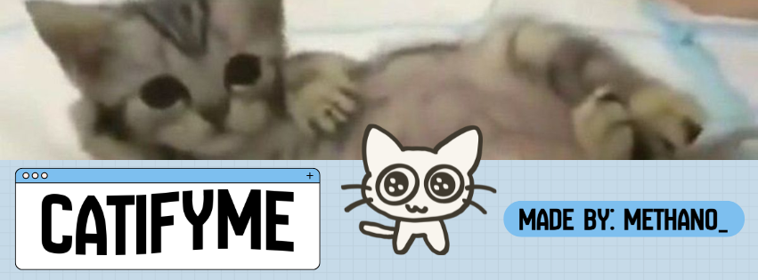

# CatifyMe
</img>

> **Vuoi scoprire come funziona l'app e la logica usata per creare il codice?**
>
> 🔗 [Visita il sito ufficiale per saperne di più](https://catifyme.pages.dev/)

---

CatifyMe è un'applicazione che crea un gattino virtuale (in stile VTuber) che si muove in tempo reale copiando le tue espressioni della faccia e i movimenti delle mani. 

Il programma usa la webcam del computer e l'intelligenza artificiale per capire cosa stai facendo. Poi, prende i disegni del gatto (che sono in formato SVG) e li incolla sopra il video della telecamera modificandoli in base a come ti muovi.

## Cosa fa il Codice

* **Trova i punti del corpo:** Usa una libreria chiamata MediaPipe che riesce a individuare la posizione esatta degli occhi, della bocca e delle dita delle mani.
* **Cambia le espressioni della faccia:** * Guarda quanto tieni aperta la bocca per decidere se il gatto deve essere normale, stupito, felice o se deve sorridere (stati: rest, smile, happy, shock).
  * Controlla se hai gli occhi aperti o chiusi. Se tieni chiuso un occhio solo per un momento, fa fare l'occhiolino al gattino (stati: blink_sx, blink_dx).
* **Traccia i movimenti delle mani:** Capisce se stai salutando o facendo il segno del "pollice in su". Se muovi la mano velocemente a destra e sinistra, il gatto imita il saluto muovendo la zampa.
* **Disegna le immagini sul video:** Trasforma i file dei disegni (SVG) in immagini normali trasparenti (PNG) usando OpenCV e CairoSVG, e le unisce al video della tua webcam.
* **Pronto per diventare un programma (.EXE):** Il codice è già organizzato per essere trasformato in un programma classico per Windows usando PyInstaller, senza perdere i file delle immagini.

## Requisiti per farlo funzionare

Se vuoi avviare il codice Python sul tuo computer, devi prima installare queste librerie:
```text
opencv-python
mediapipe
cairosvg
numpy

```

*Nota per Windows: Per far funzionare la libreria CairoSVG, sul computer devono essere installati anche i file di sistema di Cairo (chiamati DLL).*

## Come si usa

### Se usi la versione già pronta (Solo Windows)

Se hai scaricato l'app già pronta dalle Release di GitHub, non devi installare Python o scrivere comandi:

1. Estrai tutti i file dal pacchetto scaricato (.zip) in una cartella sul Desktop.
2. Controlla che la cartella con le immagini (`imgs/`) sia dentro la stessa cartella del programma.
3. Clicca due volte sul file `CatifyMe.exe` per farlo partire.

### Se vuoi avviare il codice su Windows

1. Controlla che la cartella `imgs/` (con tutti i disegni del gatto) sia nella stessa cartella del file del codice.
2. Apri il terminale e scrivi questo comando per avviare il file specifico per Windows:

```bash
python main_windows.py

```

### Se vuoi avviare il codice su Mac (macOS)

Sui computer Mac serve un passaggio in più, perché bisogna installare prima un componente di sistema (Cairo) tramite Homebrew:

1. Apri il terminale del Mac e installa i file di sistema necessari scrivendo:

```bash
brew install cairo pkg-config

```

2. Installa le librerie Python scrivendo:

```bash
pip install opencv-python mediapipe cairosvg numpy

```

3. Avvia il file del codice specifico per Mac:

```bash
python3 main_macos.py

```

### Come muoversi dentro l'interfaccia

Appena apri il programma si vedrà una schermata nera per scegliere la webcam: premi i tasti `A` o `D` sulla tastiera per cambiare telecamera, e premi `INVIO` quando vedi quella giusta. Se vuoi chiudere il programma in qualsiasi momento, ti basta premere il tasto `Q`.

---

*Sviluppato da [@methanoo](https://www.google.com/search?q=https://github.com/methanoo) con amore <3*
